<!-- Animated Header Banner -->

  <b>Software Developer</b> focused on <b>AI/ML, LLM Integrations, and High-Performance Async Backends</b>. 
  Building production-grade intelligent platforms with <b>FastAPI, React, Python, MongoDB & PostgreSQL</b>. 
  <i>Actively practicing DSA in Java to write clean, time-optimal algorithms.</i>

  
  
  
  

 

<!-- SECTION 1: IDENTITY & NEOFETCH -->

  <h3><code>sahil@github ~ $ whoami</code></h3>
  <table>
    <tr>
      <td valign="top" align="center">
        
      </td>
      <td valign="top" align="center">
        
      </td>
    </tr>
  </table>

 

<!-- SECTION 2: LIVE CONTRIBUTION HEATMAP -->

  <h3><code>sahil@github ~ $ ./contributions.sh</code></h3>
  

 

<!-- SECTION 3: FEATURED PROJECTS -->

  <h3><code>sahil@github ~ $ cat featured_projects.md</code></h3>

<table>
  <tr>
    <td width="50%" valign="top">
      <h3 align="center">🚀 NewsAura — AI News Intelligence</h3>
      
<b>Async AI-powered news analytics & fake news detection platform.</b>

      <ul>
        <li>Integrated <b>2 HuggingFace transformer models</b> for real-time fake news detection and sentiment analysis.</li>
        <li>Built async <b>FastAPI</b> backend with <b>Redis</b> caching (15-min TTL) cut redundant ML inference.</li>
        <li>TTS voice conversion via <b>AWS Polly</b> & containerized on <b>Google Cloud Run</b> with Docker.</li>
      </ul>
      

        <code>FastAPI</code> · <code>Python</code> · <code>HuggingFace</code> · <code>MongoDB</code> · <code>Redis</code> · <code>Docker</code> · <code>GCP</code>
      

    </td>
    <td width="50%" valign="top">
      <h3 align="center">⚡ Real-Time Audit Log & Fund Transfer</h3>
      
<b>High-concurrency financial engine with 100% audit log coverage.</b>

      <ul>
        <li>Engineered atomic debit-credit transactions using PostgreSQL locks & transactions with zero partial transfers.</li>
        <li>Implemented JWT session security with Clerk authentication & balance updates within 1-2 seconds.</li>
        <li>Full-stack architecture built with <b>React.js</b>, <b>FastAPI</b>, and compound SQL indexes.</li>
      </ul>
      

        <code>React</code> · <code>FastAPI</code> · <code>PostgreSQL</code> · <code>JWT</code> · <code>TailwindCSS</code>
      

    </td>
  </tr>
</table>

 

<!-- SECTION 4: TECH STACK & SKILLS -->

  <h3><code>sahil@github ~ $ neofetch --skills</code></h3>
  

    
  

 

<!-- SECTION 5: GITHUB STATS & METRICS -->

  <h3><code>sahil@github ~ $ ./stats.sh</code></h3>
  

    
    
  

  

    
  

 

<!-- SECTION 6: FOOTER & CONNECT -->

  <h3><code>sahil@github ~ $ cat socials.sh</code></h3>
  
  

    
    
    
    
  

  

    
  

  <i>⚡ Auto-refreshed daily via GitHub Actions SVG pipeline. Handcrafted with terminal aesthetics.</i>

